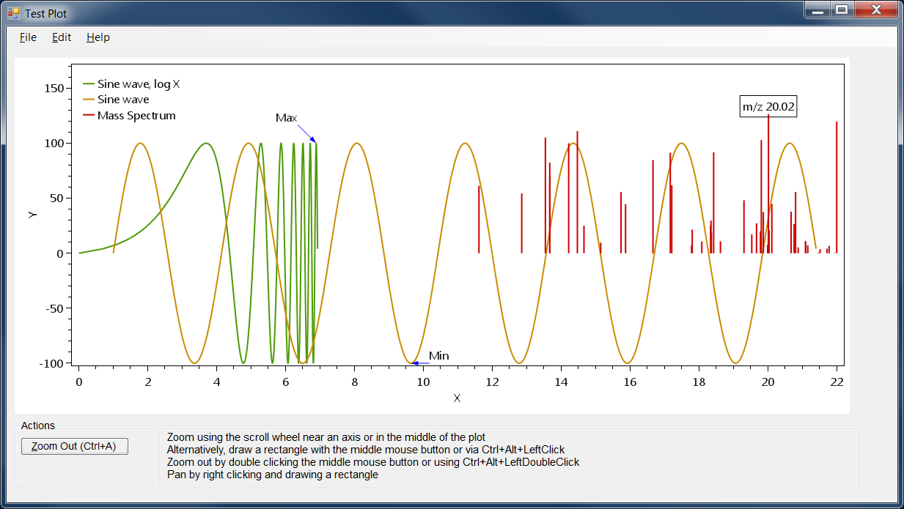

# OxyDataPlotter

The OxyDataPlotter library includes a WinForms control with a customizable instance of OxyPlot.

Methods are provided for displaying data and annotating data on the plot.

Menu items are provided for copying displayed data to the clipboard and for
saving the plot as a PNG or SVG file.

### Required Libraries

OxyPlot Core Library
* https://www.nuget.org/packages/OxyPlot.Core/

OxyPlot for Windows Forms
* https://www.nuget.org/packages/OxyPlot.WindowsForms

SVG Rendering Library 
* https://www.nuget.org/packages/Svg/

### Screenshots



### Example Usage

```csharp
var spectrum = new OxyDataPlotter.Spectrum();

spectrum.SetDataXvsY(1, xData, yData, dataCount, ctlOxyPlotControl.SeriesPlotMode.PointsAndLines, "Test Series");
spectrum.SetDataXvsY(2, xPoints, yPoints, pointCount, ctlOxyPlotControl.SeriesPlotMode.Points, "Test Points");
spectrum.SetDataXvsY(2, mzValues, intensities, mzDataCount, ctlOxyPlotControl.SeriesPlotMode.SticksToZero, "MS Data");

spectrum.SetSeriesLineStyle(1, OxyPlot.LineStyle.Automatic);
spectrum.SetSeriesLineStyle(2, OxyPlot.LineStyle.Automatic);

spectrum.SetSeriesPointStyle(1, OxyPlot.MarkerType.Diamond);
spectrum.SetSeriesPointStyle(2, OxyPlot.MarkerType.Square);
spectrum.SetSeriesPointStyle(3, OxyPlot.MarkerType.None);

spectrum.SetSeriesColor(1, System.Drawing.Color.Blue);
spectrum.SetSeriesColor(2, System.Drawing.Color.Red);
spectrum.SetSeriesColor(3, System.Drawing.Color.FromArgb(255, 20, 210, 20));

spectrum.SetSeriesLineWidth(1, 1);
spectrum.SetSeriesLineWidth(2, 7);
spectrum.SetSeriesLineWidth(3, 2);

spectrum.ShowSpectrum();
```

-------------------------------------------------------------------------------
Written by Matthew Monroe for the Department of Energy (PNNL, Richland, WA)
Copyright 2017, Battelle Memorial Institute.  All Rights Reserved.

E-mail: matthew.monroe@pnnl.gov or matt@alchemistmatt.com \
Website: http://panomics.pnl.gov/ or http://www.sysbio.org/resources/staff/
-------------------------------------------------------------------------------

Licensed under the Apache License, Version 2.0; you may not use this file except
in compliance with the License.  You may obtain a copy of the License at
http://www.apache.org/licenses/LICENSE-2.0

